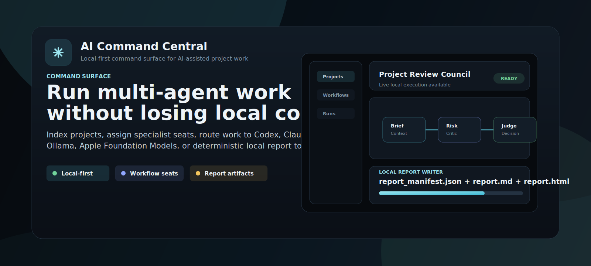
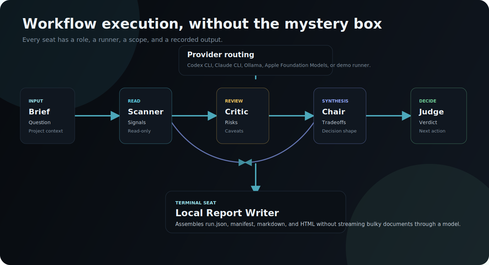
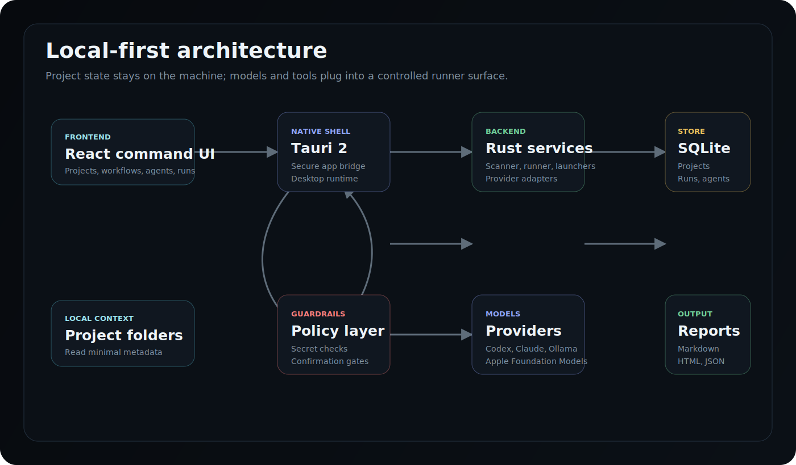
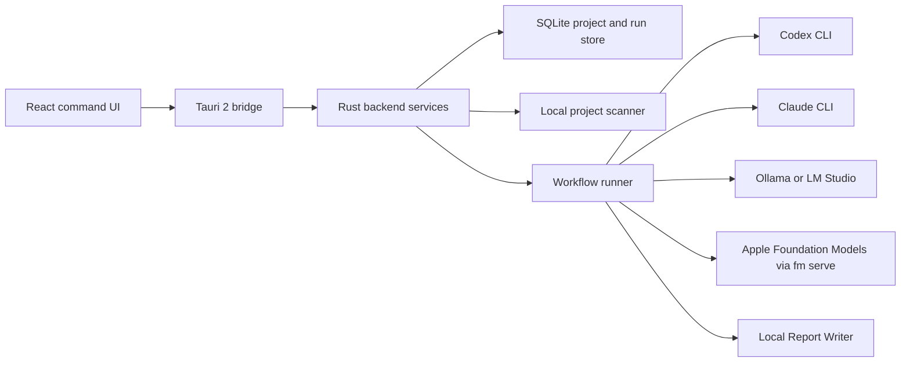
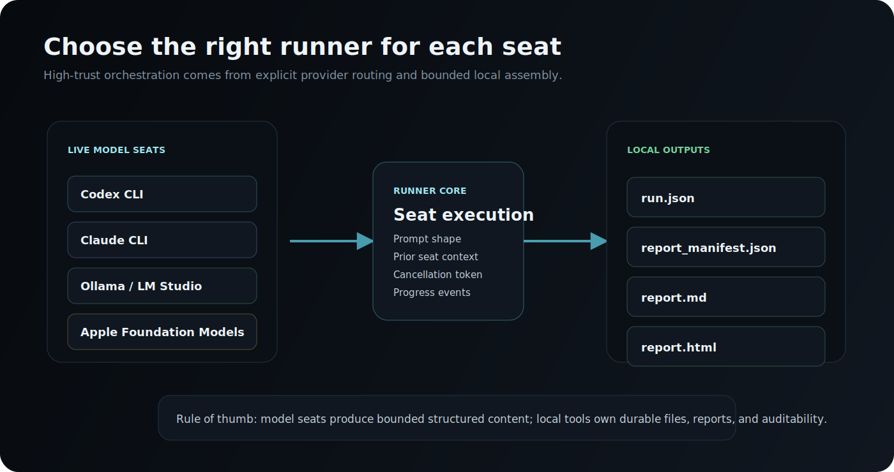
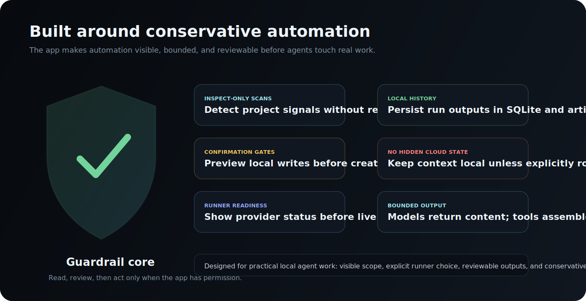

# AI Command Central

<p align="center">
  
</p>

<p align="center">
  <strong>A local-first command surface for project-aware AI agents.</strong>
</p>

<p align="center">
  <a href="#capabilities">Capabilities</a> |
  <a href="#how-runs-work">How Runs Work</a> |
  <a href="#local-providers">Local Providers</a> |
  <a href="#development">Development</a>
</p>

<p align="center">
  
  
  
  
  
</p>

AI Command Central is a desktop workbench for coordinating AI-assisted project work without turning the whole workspace into an opaque chat transcript. It indexes local project signals, makes agent readiness visible, routes workflow seats to the right runner, and assembles durable local report artifacts.

The app is designed for Mac-first, local-first work: browser preview is useful for UI exploration, while the native Tauri app enables real local scans, provider checks, CLI bridges, local model calls, and report writing.

## Capabilities

| Capability | What it does |
| --- | --- |
| Project intelligence | Scans configured local roots, detects project type, recent activity, git state, agent markers, and secret-shaped env risks. |
| Agent library | Maintains specialist agent profiles for research, criticism, synthesis, forecasting, architecture, market sizing, vendor comparison, incident review, and local analysis. |
| Workflow Studio | Builds multi-seat workflows with visible nodes, dependencies, authority levels, tool expectations, and output formats. |
| Live runner routing | Assigns seats to Codex CLI, Claude CLI, local OpenAI-compatible endpoints, Apple Foundation Models via `fm serve`, or deterministic system tools. |
| Readiness checks | Shows which runners are available before a live run, including provider health checks and model availability. |
| Local reports | Converts structured run output into `run.json`, `report_manifest.json`, `report.md`, and `report.html` using a local report writer. |
| Guardrails | Keeps scan, runner, and write boundaries visible so sensitive work can stay inspectable and controlled. |

## How Runs Work

<p align="center">
  
</p>

Runs are composed from explicit workflow seats. Each seat has a role, authority level, assigned runner, inputs, and expected output format. A typical council-style run moves from brief to scan, risk review, synthesis, and decision. Report workflows add a final local system seat that assembles the finished artifacts on disk instead of streaming a large document through a model response.

Included workflow families include:

- Project Review Council
- Ship Readiness
- Research Sprint
- Judged Council
- Private Brief - local
- Draft and Refine - local
- Architecture Decision Report
- Market Sizing Report
- KPI Diagnostics Report
- Vendor Comparison Report
- Incident Review Report
- Customer Research Synthesis

## Architecture

<p align="center">
  
</p>



The frontend is React, TypeScript, and Vite. The desktop shell is Tauri 2. The backend is Rust with SQLite for local state, `ignore` for project walking, `reqwest` for provider checks, and a native runner layer for CLI and local endpoint execution.

## Local Providers

<p align="center">
  
</p>

AI Command Central treats models and tools as runners that should be selected for the job, not as a single default answer machine.

| Runner | Best fit | Notes |
| --- | --- | --- |
| Codex CLI | Codebase reasoning, local project inspection, implementation-oriented research seats. | Used with read-only runner prompts for inspection-style seats. |
| Claude CLI | Broad reasoning, drafting, synthesis, and review workflows when available locally. | Useful for language-heavy specialist seats. |
| Ollama or LM Studio | Private local summarization, extraction, drafting, and bounded transformations. | Uses local endpoint configuration and model availability checks. |
| Apple Foundation Models | Lightweight Mac-native local tasks such as short summaries, classification, rewriting, and private context shaping. | Select when on-device convenience matters more than large context, live web evidence, or heavyweight coding work. |
| Local Report Writer | Deterministic artifact generation after model seats finish. | Produces `run.json`, `report_manifest.json`, `report.md`, and `report.html`. |

### Apple Foundation Models

On supported macOS builds, start Apple's local endpoint:

```bash
fm serve --host 127.0.0.1 --port 1976
```

Then in the app, open Settings, choose Local endpoint, and select Use Apple Foundation Models. The built-in guidance nudges users toward the right use cases: compact private local tasks, classification, short transformation, and summaries rather than long-context report synthesis or current-fact research.

### Ollama

The current Ollama preset expects Gemma:

```bash
ollama pull gemma4:26b
```

Use Settings -> Local endpoint -> Use Ollama Gemma 4 26B, then run Check provider.

## Safety Model

<p align="center">
  
</p>

AI Command Central is built around explicit boundaries:

- Browser preview uses demo data; native Tauri mode is required for real local scans, provider calls, and filesystem writes.
- Default scan roots are local project folders and common generated folders such as `node_modules`, `target`, and `dist` are excluded.
- Secret-shaped files are treated as risk signals, not content to print or expose.
- CLI bridge prompts instruct inspection seats to work read-only and avoid revealing secrets.
- Human-gate workflow seats can require approval before action-oriented steps.
- Rich report artifacts are assembled locally so bulky HTML, PDF-ready output, and generated files do not need to pass back through a model stream.

## Report Artifacts

Report workflows finish with a local writer step that creates a portable run folder:

```text
run.json
report_manifest.json
report.md
report.html
```

That gives every serious run a durable source artifact, a structured manifest, a readable markdown report, and a styled HTML version that can be reviewed or converted to PDF.

## Repository Layout

```text
src/                         React app, workflow UI, provider settings, imported library
src-tauri/                   Tauri app, Rust backend, SQLite, scanner, runner, provider checks
scripts/report-writer.mjs    Local report artifact writer
scripts/*.test.mjs           Report writer and workflow library verification
docs/assets/readme/          GitHub README diagrams and illustrations
docs/ROADMAP.md              Product direction and delivery notes
```

## Development

Install dependencies:

```bash
npm install
```

Run the browser preview:

```bash
npm run dev
```

Run the native desktop app:

```bash
npm run tauri:dev
```

Generate report artifacts from a run file:

```bash
npm run report:generate -- path/to/run.json path/to/output-dir
```

## Checks

```bash
npm run build
npm run test:reports
cd src-tauri && cargo test
```

## Project Status

AI Command Central is an active local desktop application. The current build focuses on project scanning, agent/workflow libraries, provider readiness, local runner routing, Apple Foundation Models support, and local report artifact generation.
